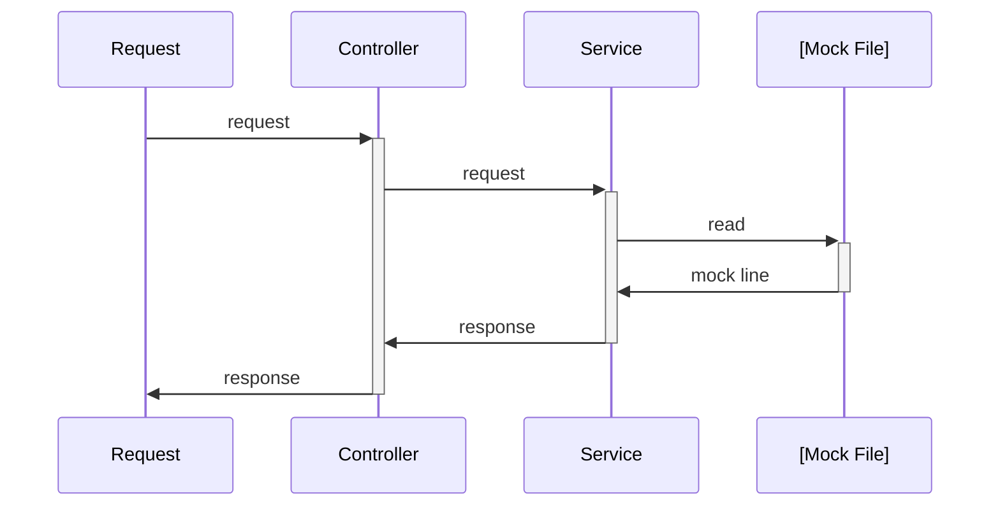

# 🖊️ About

This project is a HTTP Mock Server, thought to support development of API Rest that don't have full implementation yet. So you can use as a frontend developer to mock a server-side backend, or as a backend developer you can use to mock other microservice.

## ❔ How it works

**Data Mock File:** mock_data.json
```json
{
  "/register": {               <--- Endpoint
    "POST": {                  <--- HTTP Method
      "$.request": {           <--- Request Body
        "name": "John Doe"
      },
      "$.response": {          <--- Response
        "$.status": 200,       <--- HTTP code
        "$.body": {            <--- Response Body
          "person": {                       
            "name": "John Doe",
            "age": 30,
            "address": {
              "street": "123 Main St",
              "city": "Anytown",
              "state": "CA",
              "zip": "12345"
            }
          }
        }
      }
    },
  }
}

```


### ➡️ Request Mock
```sh
curl --request POST \
  --url http://localhost:7878/register \
  --header 'Content-Type: application/json' \
  --data '{"name": "John Doe"}'
```

### ⬅️ Return Response Mock
```json
{
  "person": {                       
    "name": "John Doe",
    "age": 30,
    "address": {
      "street": "123 Main St",
      "city": "Anytown",
      "state": "CA",
      "zip": "12345"
    }
  }
}
```

# ▶️ Start Project
### First Step
```sh
git clone https://github.com/vinicinbgs/http-mock-server.git && \
cd http-mock-server
```
### 🐳 Docker
```sh
docker-compose up -d --build
```

### 🏗️ Build
```sh
cargo build -r && \
./target/release/http_mock_server
```
**Alternative**
```sh
cargo run
```
# 📐 Architecture of Request:


# 🗺️ Roadmap

- [x] Mechanism of Mock endpoint by file
- [x] Docker enviroment
- [x] Stdout logs
- [x] Set HTTP Status Code
- [x] Pass mock file by argument `./http_mock_server -- -f=mock_data.json`
- [ ] Multiples request body with different response in the same endpoint
- [ ] Save logs on Database
- [ ] Save mocks on Database