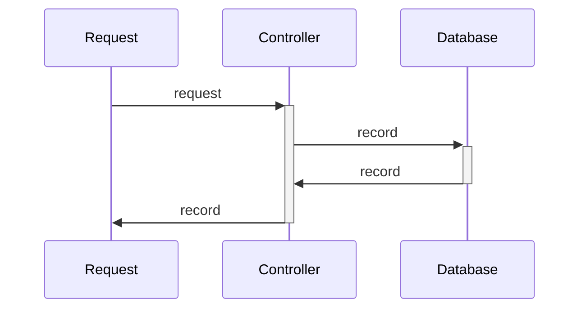

# Intro

**What is this project?**
- It is an API Mock Request / Response

**How it works?** <br />
Post Request Mock:
```sh
curl --request POST \
  --url http://localhost:7878/hello_world \
  --header 'Content-Type: application/json' \
  --data '{"message": "hello world"}'
```
Get Request Mock:
```sh
curl --request GET \
  --url http://localhost:7878/hello_world \
  --header 'Content-Type: application/json'
```
Return:
```sh
{"message":"hello world"}
```

# Architecture of Request:


# To Start Project
```sh
docker-compose up -d --build
sh request.sh
```
