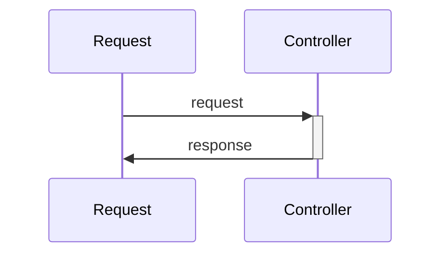

# 🖊️ About

This project is a HTTP Mock Server, thought to support development of API Rest that don't have full implementation yet. So you can use as a frontend developer to mock a server-side backend, or as a backend developer you can use to mock other microservice.

## How it works?

**Data Mock File:** mock_data.json
```json
{
  "/register": {                     <--- Endpoint
    "POST": {                  <--- HTTP Method
      "$.request": {                      <--- Request Body
        "name": "John Doe"
      },
      "person": {                        <--- Response Body
        "name": "John Doe",
        "age": 30,
        "address": {
          "street": "123 Main St",
          "city": "Anytown",
          "state": "CA",
          "zip": "12345"
        }
      }
    },
    "GET": {
      "$.request": {
        "name": "John Doe"
      },
      "person": {
        "name": "John Doe",
        "age": 30
      }
    }
  }
}

```


Post Request Mock:
```sh
curl --request POST \
  --url http://localhost:7878/hello_world \
  --header 'Content-Type: application/json' \
  --data '{"message": "hello world"}'
```

Return:
```sh
{"message":"hello world"}
```

# Architecture of Request:


# To Start Project
```sh
docker-compose up -d --build
sh request.sh
```

# 🗺️ Roadmap

- [x] Mechanism of mock endpoint by file
- [x] Docker enviroment
- [x] Stdout logs
- [ ] Set HTTP Status Code
- [ ] Multiples request body with different response in the same endpoint
- [ ] Pass mock file by argument `./http_mock_server -f mock_data.json`
- [ ] Save logs on Database
- [ ] Save mocks on Database